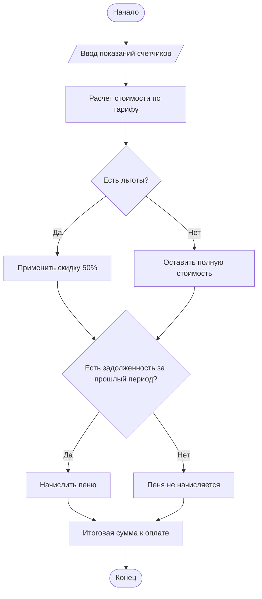

# Flowchart: Алгоритм расчета стоимости коммунальных услуг

```mermaid
flowchart TD
    Start([Начало]) --> Input[/Ввод показаний счетчиков/]
    Input --> Calc[Расчет стоимости по тарифу]
    Calc --> Check{Есть льготы?}
    
    Check -- Да --> Discount[Применить скидку 50%]
    Check -- Нет --> NoDiscount[Оставить полную стоимость]
    
    Discount --> CheckDebt{Есть задолженность за прошлый период?}
    NoDiscount --> CheckDebt
    
    CheckDebt -- Да --> AddPenalty[Начислить пеню]
    CheckDebt -- Нет --> NoPenalty[Пеня не начисляется]
    
    AddPenalty --> FinalSum[Итоговая сумма к оплате]
    NoPenalty --> FinalSum
    
    FinalSum --> End([Конец])
```
