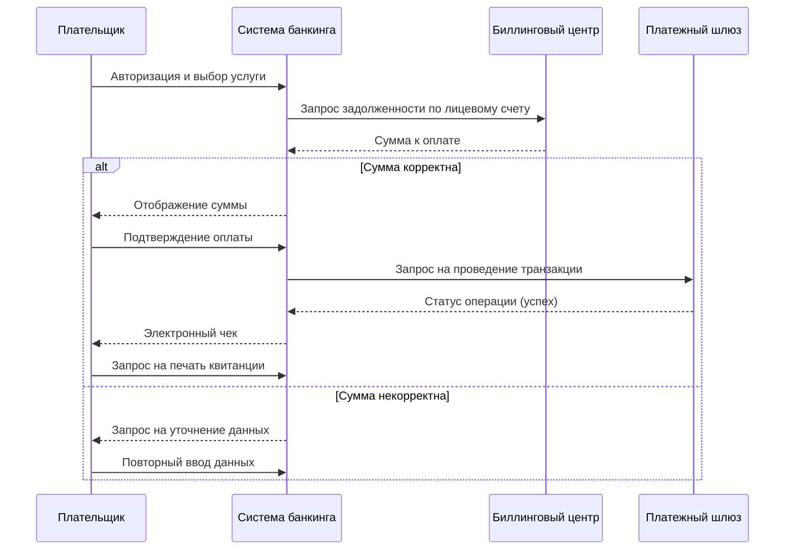

# Sequence Diagram: Оплата коммунальных услуг

```mermaid
sequenceDiagram
    participant P as Плательщик
    participant S as Система банкинга
    participant B as Биллинговый центр
    participant G as Платежный шлюз

    P->>S: Авторизация и выбор услуги
    S->>B: Запрос задолженности по лицевому счету
    B-->>S: Сумма к оплате
    
    alt Сумма корректна
        S-->>P: Отображение суммы
        P->>S: Подтверждение оплаты
        S->>G: Запрос на проведение транзакции
        G-->>S: Статус операции (успех)
        S-->>P: Электронный чек
        P->>S: Запрос на печать квитанции
    else Сумма некорректна
        S-->>P: Запрос на уточнение данных
        P->>S: Повторный ввод данных
    end
```
